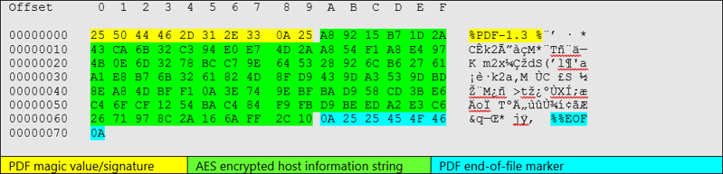

## Nobelium PdfDownloadRunAesMalware
A recreation of the "Nobelium" malware based on Microsofts Malware analysis - Part 1: PDF2Pwn
##### 1. Download PDF file from internet using WinInet library
  ###### - Supports HTTPS
  ###### - Supports DropBox API download (like in original) via adding the Bearer Token to the headers of the request
  ###### - Supports Domain Fronting by hosting malicious PDF file on CDN, sending request to shared site, and modifying the Host header to the target site 
##### 2. Strip the 10 byte PDF Header from the malicious AES Encrypted PDF
##### 3. Strip the 7 byte PDF Footer from the malicious AES Encrypted PDF
##### 4. AES Decrypt the payload using the static AES & IV - via Tiny AES code 
##### 5. Run the payload within the processes memory space using Syscalls provided by SysWhisper V2 project 
### Microsofts Malware Analysis

+ https://www.microsoft.com/security/blog/2021/05/28/breaking-down-nobeliums-latest-early-stage-toolset/
### CREDIT
+ reenz0h from Sektor7.net @SEKTOR7net - https://institute.sektor7.net/ courses got me hooked! Thank you sensai!
  + "GUI Trick" taught by reenz0h in 'RED TEAM Operator: Malware Development Essentials Course' is used to hide the console window on execution
  + Avoided using reenz0h's code for AES in proof of concept, but if you want to learn about how to incorporate AES Encryption/Decryption way better than what is done here, defiantley sign up for his RTO Malware dev essentials course. Does an epic job covering XOR & AES, function obfuscation, and more
+ @Jackson_T - Epic Syswhispers project! Thank you for this amazing project!
  + https://github.com/jthuraisamy/SysWhispers2
+ https://br-sn.github.io/Implementing-Syscalls-In-The-CobaltStrike-Artifact-Kit/ - Best blog out there for learning about how to implement syscalls into your malware
  + https://www.youtube.com/watch?v=mZyMs2PP38w <- Raphael Mudge walks through implementing syscalls in this video
  + Outflank - https://outflank.nl/blog/2020/12/26/direct-syscalls-in-beacon-object-files/ 
+ Tiny AES for an epic open-source AES project!
  + https://github.com/kokke/tiny-AES-c
+ Joseph Kingstone for getting me hooked on red teaming! - https://www.linkedin.com/in/joseph-kingstone-755b7099/
+ John Cartrett for supporting me in advancing my red team skills! - https://www.linkedin.com/in/john-cartrett/
+ John Askew for getting me deep into crypto and showing me how to use the AES project - https://www.linkedin.com/in/johnjaskew/
